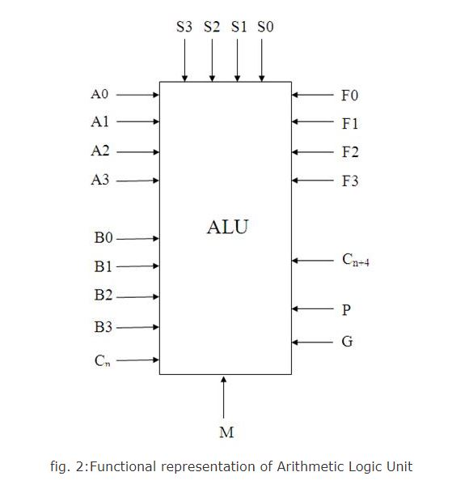
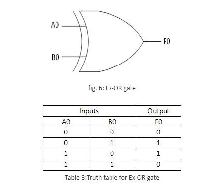

### Theory

1. **Introduction to Arithmetic Logic Unit**

In ECL, TTL and CMOS, there are available integrated packages which are referred to as arithmetic logic units (ALU). The logic circuitry in this units is entirely combinational (i.e. consists of gates with no feedback and no flip-flops).The ALU is an extremely versatile and useful device since, it makes available, in single package, facility for performing many different logical and arithmetic operations.

Arithmetic Logic Unit (ALU) is a critical component of a microprocessor and is the core component of central processing unit.

ALU's comprise the combinational logic that implements logic operations such as AND, OR and arithmetic operations, such as ADD, SUBTRACT.

Functionally, the operation of typical ALU is represented as shown in diagram below,

  2. **Functional Description of 4-bit Arithmetic Logic Unit**

Controlled by the four function select inputs (S0 to S3) and the mode control input (M), ALU can perform all the 16 possible logic operations or 16 different arithmetic operations on active HIGH or active LOW operands.

When the mode control input (M) is HIGH, all internal carries are inhibited and the device performs logic operations on the individual bits. When M is LOW, the carries are enabled and the ALU performs arithmetic operations on the two 4-bit words. The ALU incorporates full internal carry look-ahead and provides for either ripple carry between devices using the Cn+4 output, or for carry look-ahead between packages using the carry propagation (P) and carry generate (G) signals. P and G are not affected by carry in.

For high-speed operation the device is used in conjunction with the ALU carry look-ahead circuit. One carry look-ahead package is required for each group of four ALU devices. Carry look-ahead can be provided at various levels and offers high-speed capability over extremely long word lengths. The comparator output (A=B) of the device goes HIGH when all four function outputs (F0 to F3) are HIGH and can be used to indicate logic equivalence over 4 bits when the unit is in the subtract mode. A=B is an open collector output and can be wired-AND with other A=B outputs to give a comparison for more than 4 bits. The open drain output A=B should be used with an external pull-up resistor in order to establish a logic HIGH level. The A=B signal can also be used with the Cn+4 signal to indicate A > B and A < B.

The function table lists the arithmetic operations that are performed without a carry in. An incoming carry adds a one to each operation. Thus, select code LHHL generates A minus B minus 1 (2s complement notation) without a carry in and generates A minus B when a carry is applied.

Because subtraction is actually performed by complementary addition (1s complement), a carry out means borrow; thus, a carry is generated when there is no under-flow and no carry is generated when there is underflow.

As indicated, the ALU can be used with either active LOW inputs producing active LOW outputs (Table 1) or with active HIGH inputs producing active HIGH outputs (Table 2).

 Notes to the function tables:
    1. Each bit is shifted to the next more significant position.
    2. Arithmetic operations expressed in 2s complement notation.

    H = HIGH voltage level \
    L = LOW voltage level	
	
	

	
	
	3. **Logic Diagram**
	
	

	
	
	4. **Examples for arithmetic operations in ALU**

4.1 **Binary Adder-Subtractor**

The most basic arithmetic operation is the addition of two binary digits. This simple addition consists of four possible elementary operations. 0 + 0 = 0, 0 + 1 = 1, 1 + 0 = 1, 1 + 1 = 10. The first three operations produce sum of one digit, but when the both augends and addend bits are equal 1, the binary sum consists of two digits. The higher significant bit of the result is called carry .When the augends and addend number contains more significant digits, the carry obtained from the addition of the two bits is called half adder. One that performs the addition of three bits (two significant bits and a previous carry) is called half adder. The name of circuit is from the fact that two half adders can be employed to implement a full adder.

A binary adder-subtractor is a combinational circuit that performs the arithmetic operations of addition and subtraction with binary numbers. Connecting n full adders in cascade produces a binary adder for two n-bit numbers.

The subtraction circuit is included by providing a complementing circuit.

4.1.1 **Binary Adder**

A binary adder is a digital circuit that produces the arithmetic sum of two binary numbers. It can be constructed with full adder connected in cascade, the output carry from each full adder connected to the input carry of the next full adder in the chain. Fig. 4 shows the interconnection of four full adder (FA) circuits to provide a 4-bit binary ripple carry adder. The augends bits of A and addend bits of B are designated by subscript numbers from right to left, with subscript 0denoting the least significant bit. The carries are connected in the chain through the full adders. The input carry to the adder is C0 and it ripples through the full adder to the output carry C4.The S output generate the required sum bits. An n-bit adder requires n full adders with each output connected to the input carry of the next higher order full adder.

   The bits are added with full adders, starting from the position to form the sum bit and carry. The input carry C0 in the least significant position must be 0. The value of Ci+1 in a given significant position is the output carry of the full adder. This value is transferred into the input carry of the full adder that adds the bits one higher significant position to the left. The sum bits are thus generated starting from the rightmost position and are available for the correct sum bits to appear at the outputs.

The 4 bit adder is a typical example of a standard component. It can be used in many applications involving arithmetic operations. Observe that the design of this circuit by the classical method would require a truth table with 29 = 512 entries, since there are nine inputs to the circuit. By using an iterative method of cascading a standard function, it is possible to obtain a simple and straightforward implementation.

4.1.2 **Binary Subtractor**

The subtraction of unsigned binary numbers can be done most conveniently by means of complement. Subtraction A–B can be done by taking the 2's complement of B and adding it to A. The 2's complement can be obtained by taking the 1's complement and adding one to the least significant pair of bits. The 1's complement can be implemented with the inverters and a one can be added to the sum through the input carry.

The circuit for subtracting, A–B, consists of an adder with inverter placed between each data input B and the corresponding input of the full adder. The input carry C0 must be equal to 1when performing subtraction. The operation thus performed becomes A, plus the 1's complement of B, plus 1.This is equal to A plus 2's complement of B. For unsigned numbers this gives A–B if A ≥ B or the 2's complement of (B–A) if A < B. for signed numbers, the result is A – B, provided that there is no overflow.

The addition and subtraction operations can be combined into one circuit with one common binary adder. This is done by including an EX-OR gate with each full adder. A 4-bit adder-subtractor circuit is shown in fig 5. The mode input M controls the operation. When M = 0, the circuit is an adder, and when M = 1, the circuit becomes a subtractor. Each EX-OR gate receives input M and one of the inputs of B. when M = 0, we have B (Ex-OR) 0 = B. the full adder receive the value of B, the input carry is 0, and the circuit performs A plus B. when M = 1, we have B (Ex-OR) 1= B' and C0 = 1. The B inputs are complemented and a 1 is added through the input carry. The circuit performs the operation A plus the 2's complement of B. (The EX-OR with output is for detecting an overflow.)

It is worth noting that binary numbers in the signed-complemented system are added and subtracted by the same basic addition and subtraction rules as unsigned numbers. Therefore, computers need only one common hardware circuit to handle both type of arithmetic. The user or programmer must interpret the results of such addition or subtraction differently, depending on whether it is assumed that the numbers are signed or unsigned. 

   5. **Examples for Logical operations in ALU**

In a 4-bit Arithmetic Logic Unit, logical operations are performed on individual bits.

5.1 **EX-OR**

In a 4 bit ALU, the inputs given are A0, A1, A2, A3 and B0, B1, B2, B3. Operations are performed on individual bits. Thus, as shown in a fig.6, inputs, A0 and B0 will give output F0.

Similarly, for other inputs (A1, A2, A3), outputs (F1, F2, F3) are given.

Also, when active low inputs (A0', A1', A2', A3'and B0', B1', B2', B3') are taken, logical operation (here Ex-OR) can be done as shown in fig.7.

